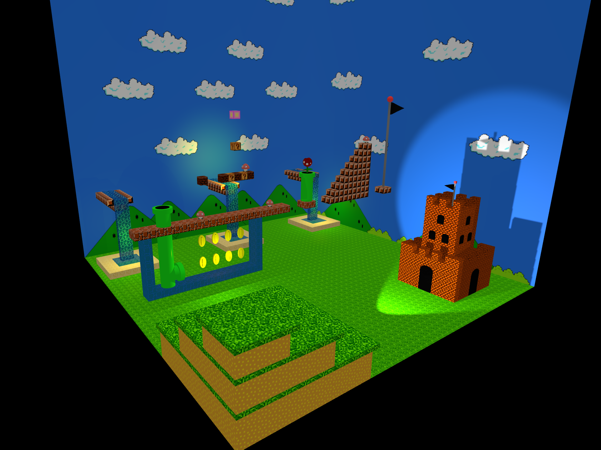
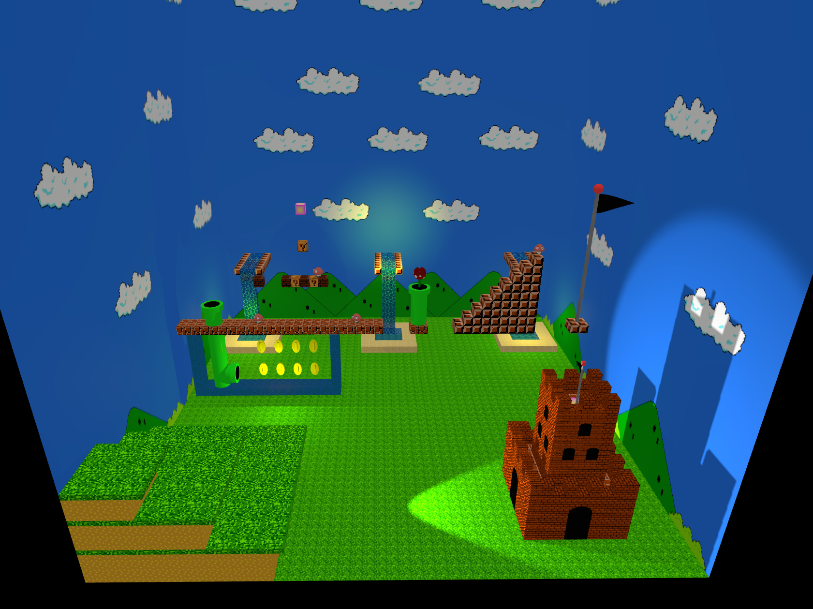

# SGI 2024/2025

## Group T08G10
| Name             | Number    | E-Mail             |
| ---------------- | --------- | ------------------ |
| Luís Alves       | 202108727 | 202108727@up.pt    |
| Nuno França      | 201807530 | 201807530@up.pt    |

----

- **Final Grade**: 19

## Projects

### [TP1 - Room](tp1)

### **Grade**: 19.5

|                |
|:------------------------------------------:|
| Image 1 - The scene                          |

|                |
|:------------------------------------------:|
| Image 2 - The scene                          |

-----

### [TP2 - Super Mario](tp2)

- **Grade**: 17.5

|                |
|:------------------------------------------:|
| Image 1 - The scene                          |

|                |
|:------------------------------------------:|
| Image 2 - The scene                          |

----

### [TP3 - Balloon Game](tp3)

- **Grade**: 19.6

|                |
|:------------------------------------------:|
| Image 1 - The scene                          |

|                |
|:------------------------------------------:|
| Image 2 - The scene                          |

