# SGI 2024/2025 - TP2

## Group T08G10
| Name             | Number    | E-Mail             |
| ---------------- | --------- | ------------------ |
| Luís Alves       | 202108727 | 202108727@up.pt    |
| Nuno França      | 201807530 | 201807530@up.pt    |

----
## Project information

The scene was created with an idea of the original Super Mario Level with some creative freedom to recreate this scene not only in 3D but also with required objects and objects that made sense to the purpose of this project.

A broad view of the scene can be seen in the next two images. 

|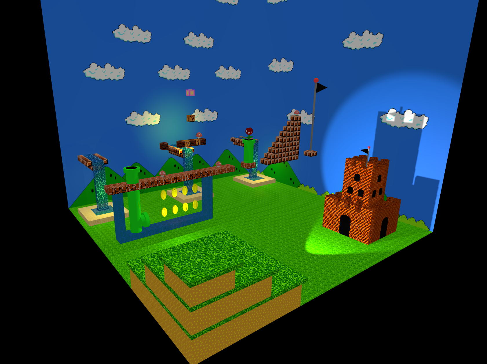                |
|:------------------------------------------:|
| Image 1 - The scene                          |

|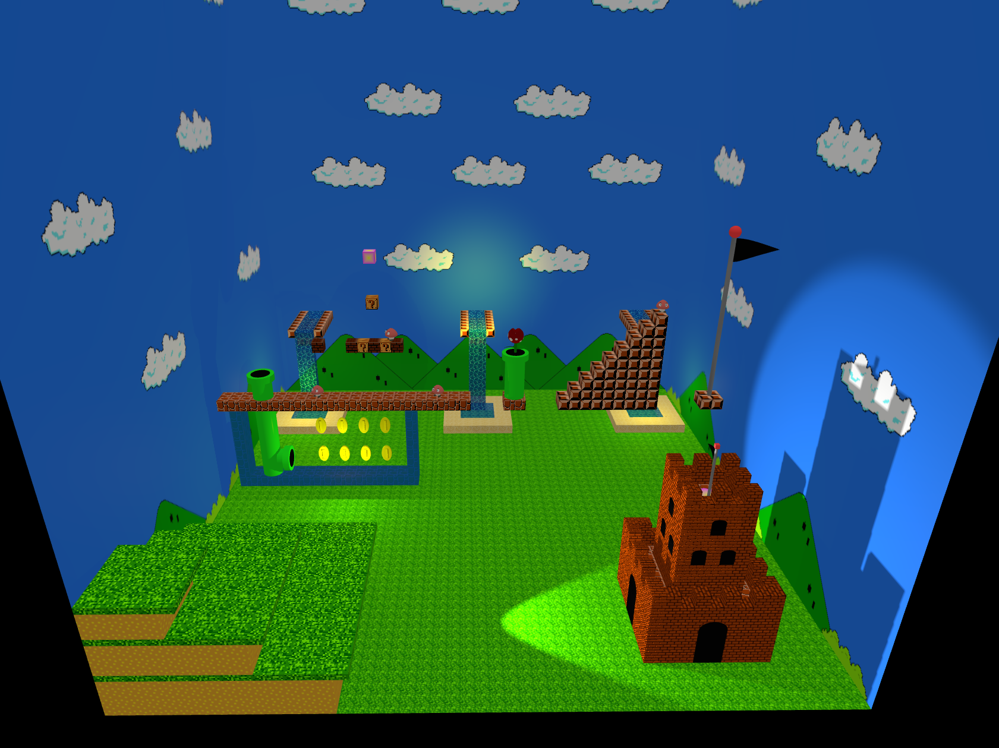                |
|:------------------------------------------:|
| Image 2 - The scene                          |

In order to create this scene, as a scene graph there are 4 children nodes from the graph. Those are:

- **mainlevel**: Consists of the "2D" Level that can be seen in the center of the scene;

- **lakes**: Are the lakes that can be seen in the left part of the scene;

- **castleright**: Castle in the right part of the scene;

- **terrain**: 3D Terrain in the bottom right part of the scene.

### Objects of the main level

|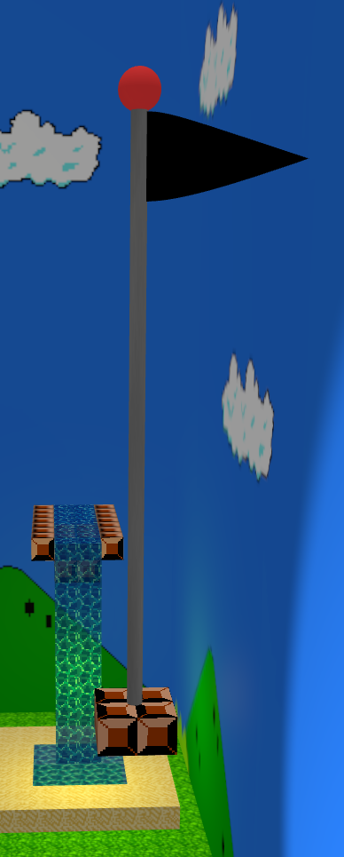                |
|:------------------------------------------:|
| Image 3 - The flag                          |

The flag was created with simple objects, mostly a cylinder for the tube geometry, a sphere and a nurbs surface for the flag material.

|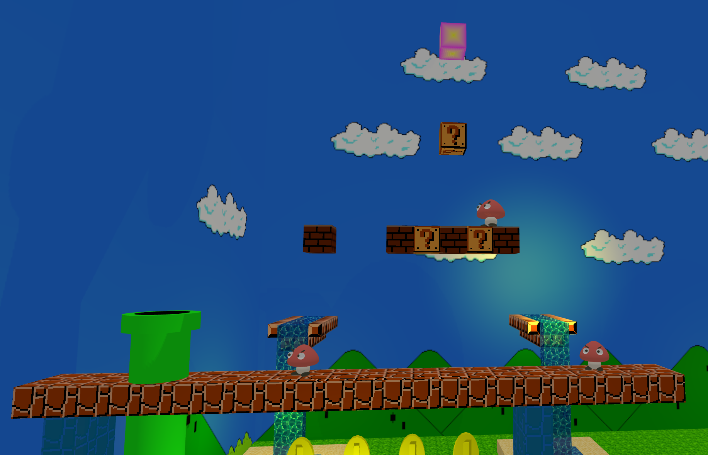                |
|:------------------------------------------:|
| Image 4 - Center of the main level        |

The main part of the main level consists mostly on box geometries, used to create the path and the boxes. The top box was constructed with 6 different polygons, with 4 stacks and 10 slices, the center color is yellow and the far color is pink.

It can also be seen multiple "goomba" like enemies accross the map, those were created with nurbs surfaces for the head and body and simple geoemtries for the rest of the node.

|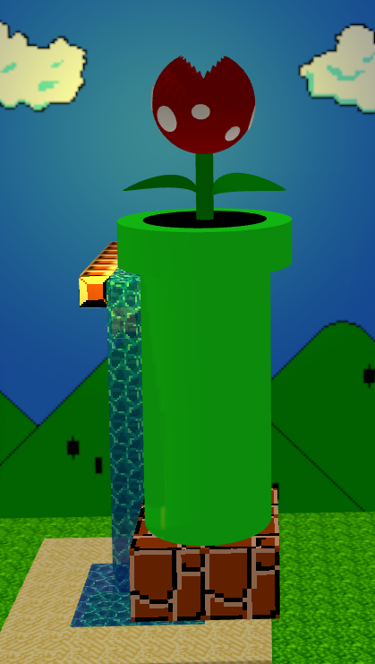                |
|:------------------------------------------:|
| Image 5 - Plant the main level        |

The plant was created with 3 different spheres, with a different values for *thetastart*, *thetalength*, *phistart*, *philength*, in order to resemble a carnivorous plant. The leaf geometries are also a nurb surface.

### Objects of the fountains

|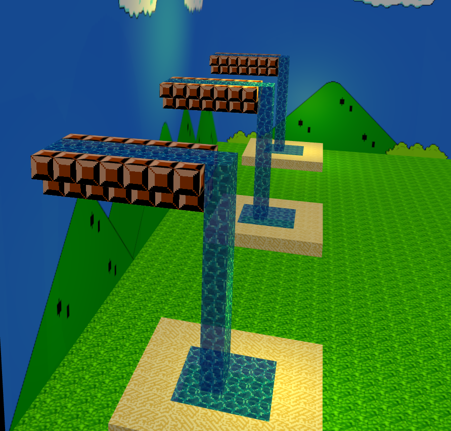                |
|:------------------------------------------:|
| Image 6 - Fountains        |

Due to size limitations, a video can't be used to showcase the fountains, but they have moving water. These fountains were also created with mostly simple geometries, mostly box geometries for every object.

### Objects of the Terrain

|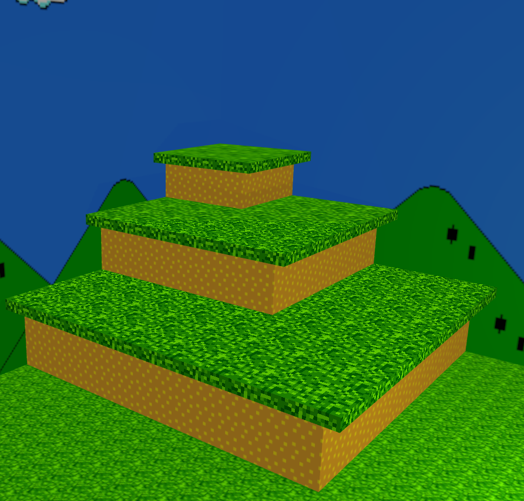                |
|:------------------------------------------:|
| Image 7 - Terrain        |

Terrain consists of 6 different box geometries with different textures, where the top of the terrain is a grass texture using mipmapping.

### Objects of the Castle

|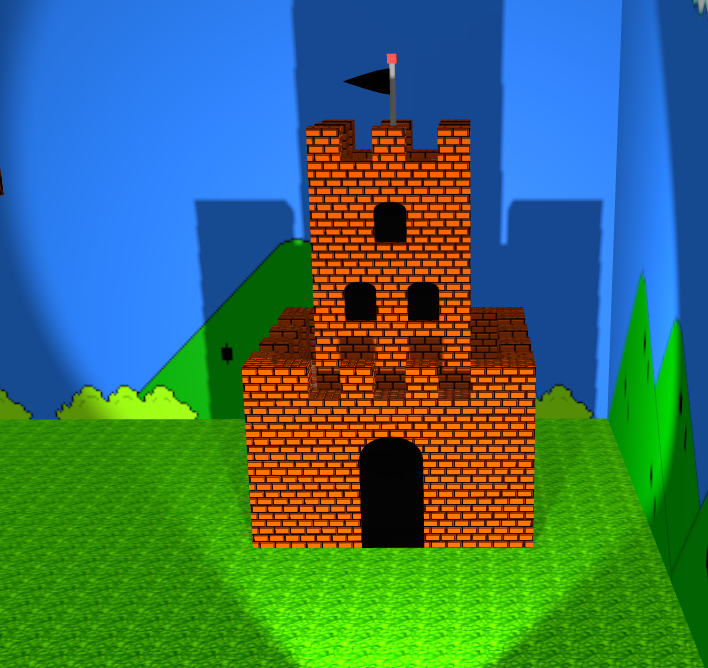                |
|:------------------------------------------:|
| Image 8 - Castle                      |

Castle was created with  box geometries, as bricks and walls, those geometries have bump textures to resemble more a castle.

It also has a cube and sphere, scaled down to 0.01 in Z, in order to look like windows and doors.

|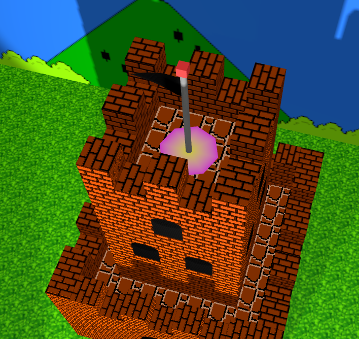                |
|:------------------------------------------:|
| Image 9 - Castle Top                     |

On top of the castle a small flag can also be encounted with a buffer geometry polygon as a base.

### GUI Interface

|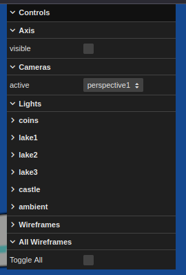                |
|:------------------------------------------:|
| Image 10 - Interface   

The json file was written with multiple lights and cameras, that can be checked and have their variables change in the interface.

|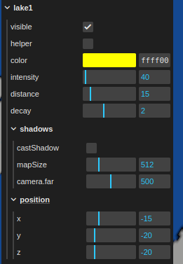                |
|:------------------------------------------:|
| Image 11 - Light changes   |

|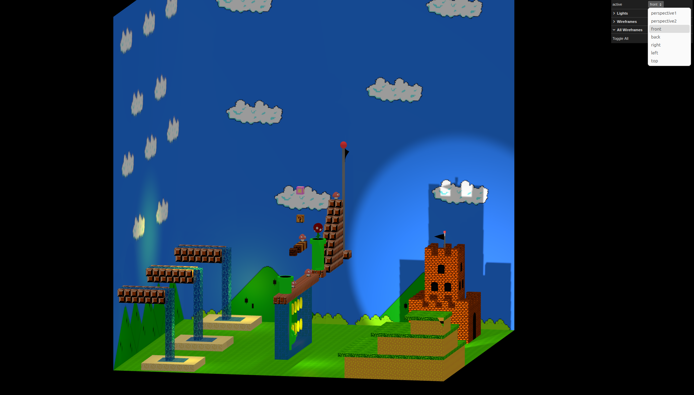                |
|:------------------------------------------:|
| Image 12 - Camera Changes  |

### Wireframe

For the wireframe, if an object has that attribute as true, it will load with the wireframe on, theres also an option to toggle the wireframe in the interface of one specific object or all objects in the scene.

|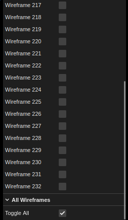                |
|:------------------------------------------:|
| Image 13 - Wireframe Interface  |

|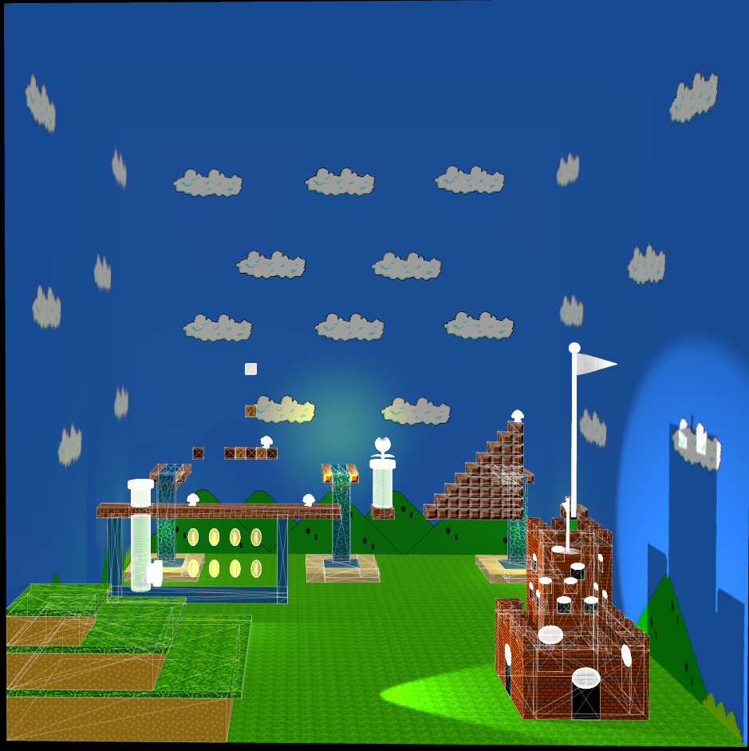                |
|:------------------------------------------:|
| Image 14 - Wireframe  |
----
## Issues/Problems

- Currently there are no known problems, however LODS are still to be implemented.
