# SGI 2024/2025 - TP3

## Group T08G10
| Name             | Number    | E-Mail             |
| ---------------- | --------- | ------------------ |
| Luís Alves       | 202108727 | 202108727@up.pt    |
| Nuno França      | 201807530 | 201807530@up.pt    |

----
## Project information

The scene was created with the idea of a great landscape where we want to relax, this project puts in practice multiple terchniques that were learned in this semester.

The following images show the overall scene, and all presented objects.

All the static objects in this scene were created with YASF, while the balloons, powerUps and Obstacles, Fireworks, were created directly on JS.

|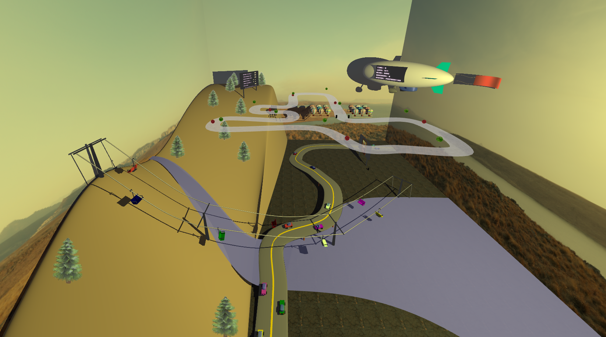                |
|:------------------------------------------:|
| Image 1 - The scene                          |

|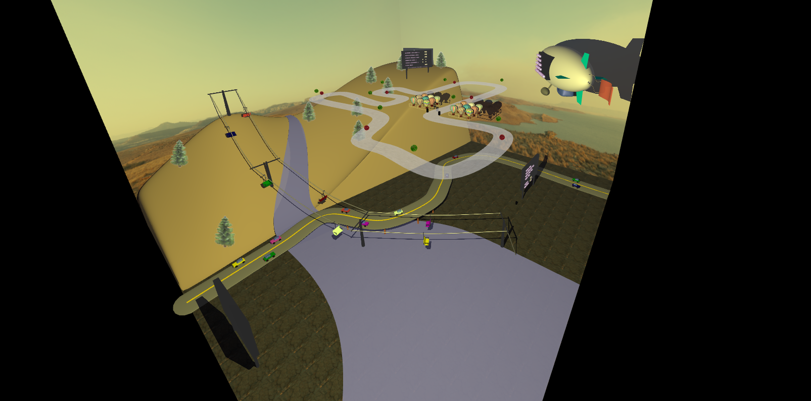                |
|:------------------------------------------:|
| Image 2 - The scene                          |

### The start menu

The following image, shows the start menu, here 3 actions need to be performed before the "Start Game" can be pressed.

|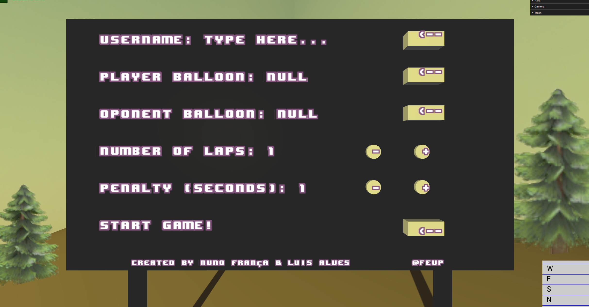                |
|:------------------------------------------:|
| Image 3 - The start menu                    |

- The user must type their name, this action only ends once the user presses *ENTER*.
- the user must choose their player balloon, the camera changes to the balloons and the player must pick one balloon and the desired spot. The spot only appears after a balloon is picked (must be a balloon from the right).
- the user must choose their Oponent balloon, the camera changes to the balloons and the player must pick one balloon (must be a balloon from the left)., the spot is picked freely, since theres only one available space. There are different balloons with different velocities, balloons in different columns have different velocities.

|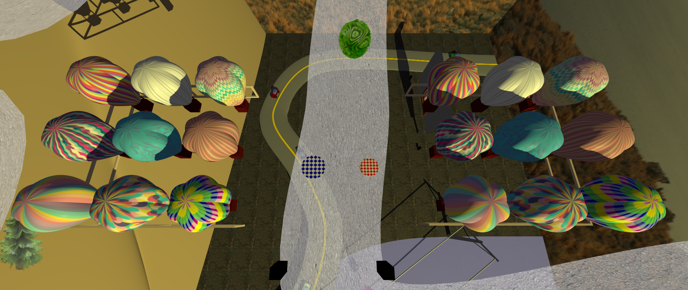                |
|:------------------------------------------:|
| Image 4 - Picking balloons                 |

### Ready / Running

Now with the game ready, the camera changes to the begginig of the track, and the game starts once "P" is pressed.

With the game running:
- “W” moves the balloon up, “S”  moves the balloon down. 
- “Space” can be pressed to pause the game or unpause the game. 
- “V” can also be pressed to cycle between three main cameras, “third person”, “first person” and a “free camera”.
- If “Escape” is pressed the game returns to the main menu, resetting all variables.
- Key “L” can be pressed to turn on/off the lights and “O” to turn on/off the shadows. This keys can be pressed anytime, except when the user is typing their name.

|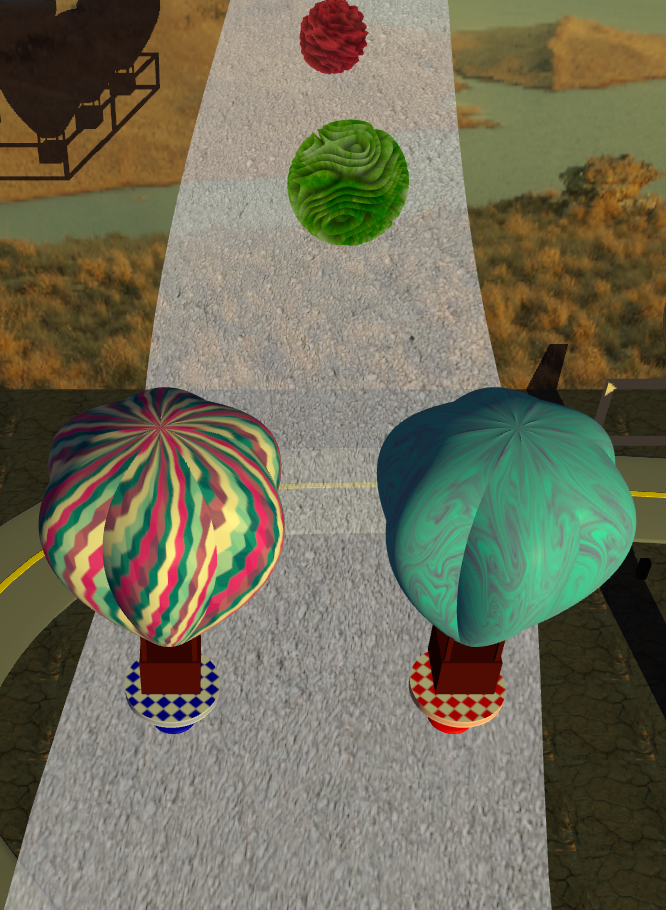              |
|:----------------------------------------:|
| Image 5 - Ready  Camera                  |

The oponent balloon moves with a key-frame animation.

In this image it can also be seen one PowerUp(Green) and one obstacle(Red), these objects have also a movement in Y and were implemented using shaders, so they animated.

### Game  Over

Once the first player reaches the last checkpoint of the last lap (in this case it was only 1 lap). The game ends, and changes camera to the Game Over camera, where the winner can be seen in this case **AI20**, the number of laps completed, the winner time, and the loser.

Two buttons can be pressed:
- Restart button, that takes us back to the Ready State with all the choosen variables from the start menu.
- Home Menu button, that takes us back to the first menu and resets all variables.
- These two buttons are complementary to the keys, since either can be chosen as a way to interact with the game. Either Restart or "R" for the Ready State. Either Home Button or "Escape" to reset all variables.

It can also be seen the firework in  action, since the game has ended, multiple fireworks explode until the stated is changed from **FINISHED**.

|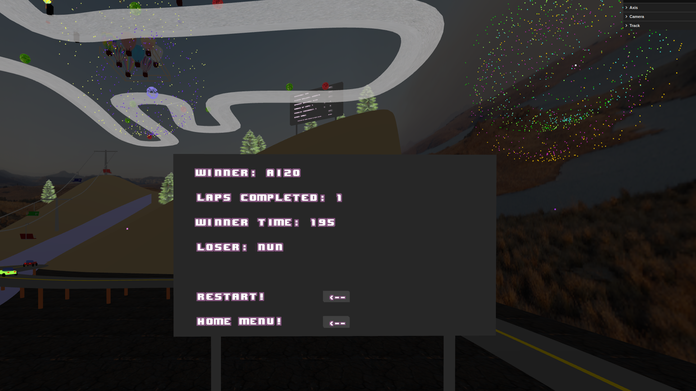              |
|:----------------------------------------:|
| Image 6 - Game Over                  |

## Implementations
 
### Track and Objects
|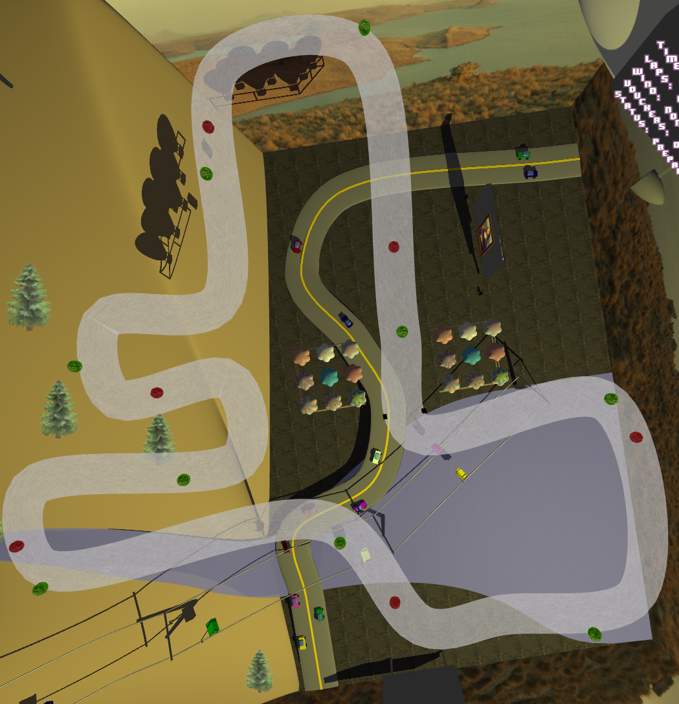              |
|:----------------------------------------:|
| Image 7 - Track and objects            |

Here the track for our game can be seen. The obstacles (Red) can also be seen as well as the power ups (Green).

### Outdoor Display

Here can be seen the implemented outdoor display, this display has multiple information that changes independtly from each other.

The display was built in a blimp handcrafted by us, where multiple tecnhiques are applied.
|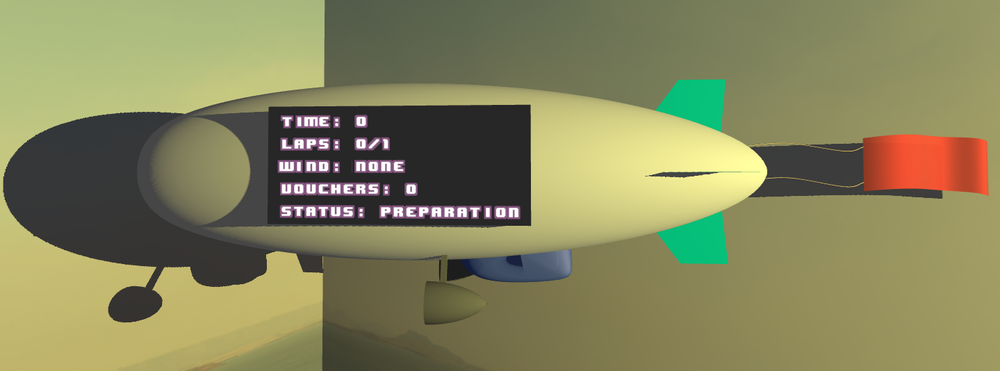              |
|:----------------------------------------:|
| Image 8 -  Outdoor Display           |

### Collision detection

The player can collide with the powerups, obstacles or the Autonomous balloon. The autonomous balloon ignores all these.

The player can also leave the track. If the player leaves the track, he is positioned again in the middle of the track with the penalty.

The obstacle moves the player backwards and makes the penalty stay N seconds still. If the player collides with the autonomous balloon, the same thing happens.

If the player collides, with the power up, it adds an extra life that removes the N seconds that the player can't move forward or backwards. 

When a collision occurs when a player has an extra life, the player still gets re-positioned, he just doesnt have the penalty N seconds.

As a creative decision, when the player is in the penalty state, he can still move up or down to re-position the balloon in the desired layer. He just isn't able to move horizontally to the track.

### Spritesheets

Spritesheets were used and can already be seen in Image 3, 6 & 8. Where they were used, to create the displays.

### Shaders

Shaders were used for the powerups and obstacles. As well as to take a snapshot of the scene and create the following paint.

|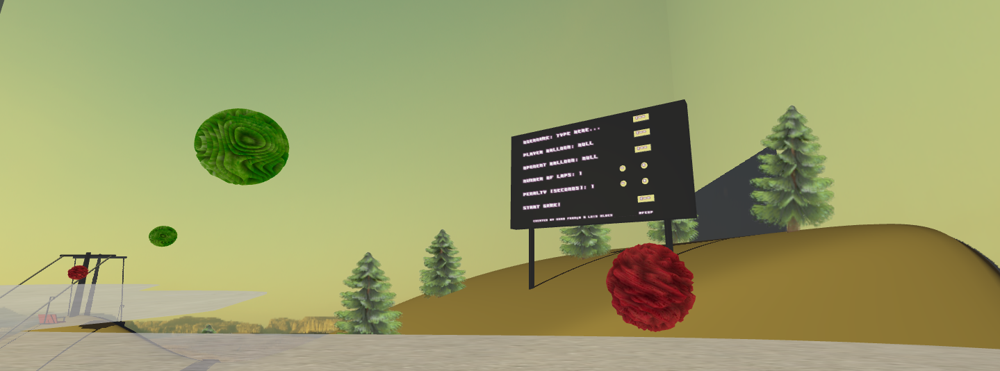              |
|:----------------------------------------:|
| Image 9 -  Shaders          |

|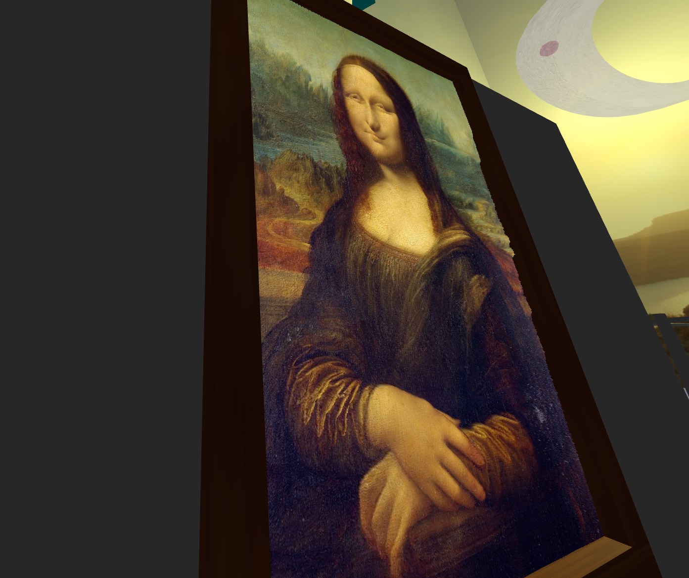              |
|:----------------------------------------:|
| Image 10 -  Shaders          |

### Particles system

The Particle system was implemented as fireworks that explodes in the track and in the game over screen. Those projectiles have a balistic effect and explode into a sphere once they reach the choosen height.

Fireworks can be seen in image 6.

### LOD AI

Here can be seen the implemented LOD for the autonomous bullons once it stray further from the active camera.

|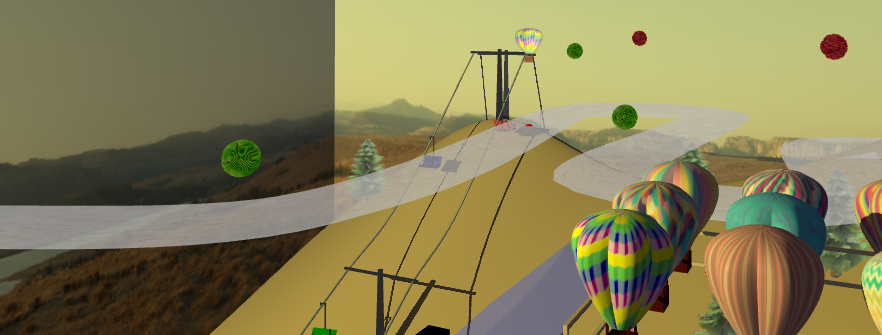              |
|:----------------------------------------:|
| Image 11 -  LOD Autonomous balloon           |

---- 
## Issues/Problems

- Every point from the guide was implemented.

- Currently there are no known problems, with extra time, new and more detailed objects would be added to the scene (airplanes, boats, etc...). The plan was to have those objects have key-frame animation.